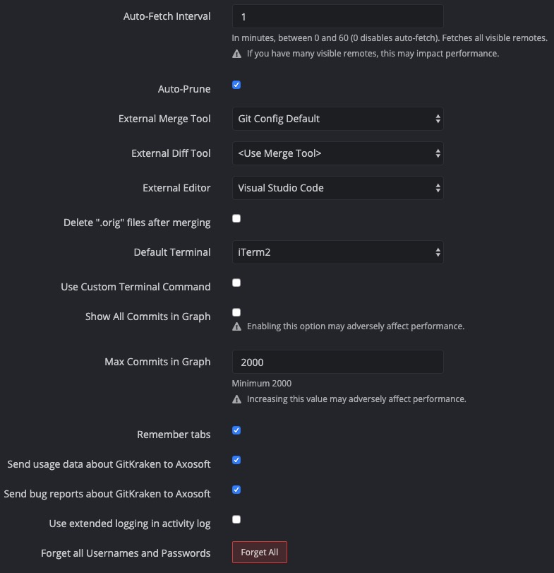
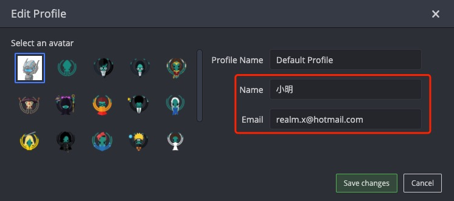

## 工具包管理
  - 安装
    |    系统 | 工具                                     |
    | ------: | :--------------------------------------- |
    |     Mac | [Homebrew](https://brew.sh)              |
    | Windows | [Chocolatey](https://www.chocolatey.org) |

## Node
  - 安装
    |    系统 | 工具                   |                                                                   |
    | ------: | :--------------------- | :---------------------------------------------------------------- |
    |     Mac | `brew install node`    |                |
    | Windows | `choco install nodejs` |  |

## Git
  - 安装
    |    系统 | 工具                | 版本                                                           |
    | ------: | :------------------ | :------------------------------------------------------------- |
    |     Mac | `brew install git`  |              |
    | Windows | `choco install git` |  |

  - 配置
    ```shell
    # 设置用户名
    git config --global user.name [xxx]

    # 设置邮箱
    git config --global user.email [xxx@xxx.xxx]

    # 显示颜色
    git config --global color.ui true

    # 默认推送当前分支
    git config --global push.default current

    # 拉取远程分支时，是否使用快速合并
    git config --global pull.ff false

    # 拉取远程分支时，是否保持提交曲线为直线
    git config --global pull.rebase true
    ```

## 终端工具
  - 安装
    |    系统 | 工具                             |                           |
    | ------: | :------------------------------- | :------------------------ |
    |     Mac | [iTerm2](https://www.iterm2.com) |                           |
    | Windows | `Git Bash`                       | 👈 安装`Git`工具后即可使用 |

  - 终端切换
    > 用于 Mac 环境

    | 终端 | 命令                |        |
    | ---: | :------------------ | :----- |
    |  zsh | `chsh -s /bin/zsh`  | 👈 推荐 |
    | bash | `chsh -s /bin/bash` |        |

## VSCode
  - 安装[[下载地址](https://code.visualstudio.com/Download)]

  - 插件
    |                                                                                                    插件 | 版本                                                                                                                                                                                                                                                                                                                       |
    | ------------------------------------------------------------------------------------------------------: | :------------------------------------------------------------------------------------------------------------------------------------------------------------------------------------------------------------------------------------------------------------------------------------------------------------------------- |
    |                      [Easy LESS](https://marketplace.visualstudio.com/items?itemName=mrcrowl.easy-less) | [](https://marketplace.visualstudio.com/items?itemName=mrcrowl.easy-less) [](https://marketplace.visualstudio.com/items?itemName=mrcrowl.easy-less)                         |
    |                     [minapp](https://marketplace.visualstudio.com/items?itemName=qiu8310.minapp-vscode) | [](https://marketplace.visualstudio.com/items?itemName=qiu8310.minapp-vscode) [](https://marketplace.visualstudio.com/items?itemName=qiu8310.minapp-vscode)         |
    | [Prettier - Code formatter](https://marketplace.visualstudio.com/items?itemName=esbenp.prettier-vscode) | [](https://marketplace.visualstudio.com/items?itemName=esbenp.prettier-vscode) [](https://marketplace.visualstudio.com/items?itemName=esbenp.prettier-vscode)     |
    |                               [Vetur](https://marketplace.visualstudio.com/items?itemName=octref.vetur) | [](https://marketplace.visualstudio.com/items?itemName=octref.vetur) [](https://marketplace.visualstudio.com/items?itemName=octref.vetur)                                             |
    |           [Vue 2 Snippets](https://marketplace.visualstudio.com/items?itemName=hollowtree.vue-snippets) | [](https://marketplace.visualstudio.com/items?itemName=hollowtree.vue-snippets) [](https://marketplace.visualstudio.com/items?itemName=hollowtree.vue-snippets) |

  - 配置
    <details>
    <summary>--------------------------------------------- 👉 点击展开 👈 ---------------------------------------------</summary>

    ```json
    {
      "editor.formatOnSave": true,
      "editor.stablePeek": true,
      "editor.tabCompletion": "on",
      "editor.tabSize": 2,
      "editor.wordWrapColumn": 120,
      "editor.minimap.enabled": false,
      "explorer.openEditors.visible": 0,
      "search.exclude": {
        "**/dist": true,
        "**/miniprogram_npm": true
      },
      "files.watcherExclude": {
        "**/dist/**": true,
        "**/miniprogram_npm/**": true
      },
      "files.associations": {
        "*.cjson": "jsonc",
        "*.wxs": "javascript",
        "*.wxss": "css"
      },
      "emmet.includeLanguages": {
        "wxml": "html"
      },
      "minapp-vscode.wxmlFormatter": "prettyHtml",
      "minapp-vscode.formatMaxLineCharacters": 120,
      "minapp-vscode.disableAutoConfig": true,
      "minapp-vscode.showSuggestionOnEnter": true,
      "minapp-vscode.prettier": {
        "printWidth": 120,
        "semi": false,
        "singleQuote": true,
        "trailingComma": "none"
      },
      "minapp-vscode.prettyHtml": {
        "printWidth": 120,
        "usePrettier": false,
        "sortAttributes": true
      },
      "vetur.format.defaultFormatterOptions": {
        "prettyhtml": {
          "printWidth": 120,
          "usePrettier": false,
          "sortAttributes": true
        },
        "prettier": {
          "printWidth": 120,
          "semi": false,
          "singleQuote": true,
          "trailingComma": "none"
        }
      },
      "prettier.printWidth": 120,
      "prettier.singleQuote": true,
      "prettier.semi": false,
      "prettier.trailingComma": "none",
      "less.compile": {
        "outExt": ".wxss"
      }
    }
    ```
    </details>

## 小程序编辑器

  - 安装[[下载地址](https://developers.weixin.qq.com/miniprogram/dev/devtools/download.html)]
    > 建议使用预发布版，若有问题，可换稳定版

  - 插件
    |                                                                                                    插件 | 版本                                                                                                                                                                                                                                                                                                                   |
    | ------------------------------------------------------------------------------------------------------: | :--------------------------------------------------------------------------------------------------------------------------------------------------------------------------------------------------------------------------------------------------------------------------------------------------------------------- |
    |                      [Easy LESS](https://marketplace.visualstudio.com/items?itemName=mrcrowl.easy-less) | [](https://marketplace.visualstudio.com/items?itemName=mrcrowl.easy-less) [](https://marketplace.visualstudio.com/items?itemName=mrcrowl.easy-less)                     |
    |                     [minapp](https://marketplace.visualstudio.com/items?itemName=qiu8310.minapp-vscode) | [](https://marketplace.visualstudio.com/items?itemName=qiu8310.minapp-vscode) [](https://marketplace.visualstudio.com/items?itemName=qiu8310.minapp-vscode)     |
    | [Prettier - Code formatter](https://marketplace.visualstudio.com/items?itemName=esbenp.prettier-vscode) | [](https://marketplace.visualstudio.com/items?itemName=esbenp.prettier-vscode) [](https://marketplace.visualstudio.com/items?itemName=esbenp.prettier-vscode) |

  - 配置
    > 需创建或打开项目后才能修改扩展配置
    <details>
    <summary>--------------------------------------------- 👉 点击展开 👈 ---------------------------------------------</summary>

    ```json
    {
      "editor.formatOnSave": true,
      "editor.stablePeek": true,
      "editor.tabCompletion": "on",
      "editor.tabSize": 2,
      "editor.wordWrapColumn": 120,
      "editor.minimap.enabled": false,
      "explorer.openEditors.visible": 0,
      "search.exclude": {
        "**/dist": true,
        "**/miniprogram_npm": true
      },
      "files.watcherExclude": {
        "**/dist/**": true,
        "**/miniprogram_npm/**": true
      },
      "files.associations": {
        "*.cjson": "jsonc",
        "*.wxs": "javascript",
        "*.wxss": "css"
      },
      "[wxml]": {
        "editor.defaultFormatter": "qiu8310.minapp-vscode"
      },
      "[css]": {
        "editor.defaultFormatter": "esbenp.prettier-vscode"
      },
      "[json]": {
        "editor.defaultFormatter": "esbenp.prettier-vscode"
      },
      "[javascript]": {
        "editor.defaultFormatter": "esbenp.prettier-vscode"
      },
      "minapp-vscode.wxmlFormatter": "prettyHtml",
      "minapp-vscode.formatMaxLineCharacters": 120,
      "minapp-vscode.disableAutoConfig": true,
      "minapp-vscode.showSuggestionOnEnter": true,
      "minapp-vscode.prettier": {
        "printWidth": 120,
        "semi": false,
        "singleQuote": true,
        "trailingComma": "none"
      },
      "minapp-vscode.prettyHtml": {
        "printWidth": 120,
        "usePrettier": false,
        "sortAttributes": true
      },
      "prettier.printWidth": 120,
      "prettier.singleQuote": true,
      "prettier.semi": false,
      "prettier.trailingComma": "none",
      "less.compile": {
        "outExt": ".wxss"
      }
    }
    ```
    </details>

## GitKraken
  - 安装
    |    系统 | 工具                                                                                                                                       |
    | ------: | :----------------------------------------------------------------------------------------------------------------------------------------- |
    |     Mac | [GitKraken](https://release.gitkraken.com/darwin/installGitKraken.dmg)                                                                     |
    | Windows | GitKraken [64bit](https://release.gitkraken.com/win64/GitKrakenSetup.exe)，[32bit](https://release.gitkraken.com/win32/GitKrakenSetup.exe) |

  - 登录
    > 免费版无法长期使用私有仓库  
      找【 技术经理 】解决帐号密码登录问题  
      若自行购买授权，需要支持美元支付的卡【`VISA` 和 `MASTERCARD`】

  - 配置
    <details>
    <summary>--------------------------------------------- 👉 点击展开 👈 ---------------------------------------------</summary>

    - General

      

    - Profile

      

    - SSH
    </details>
